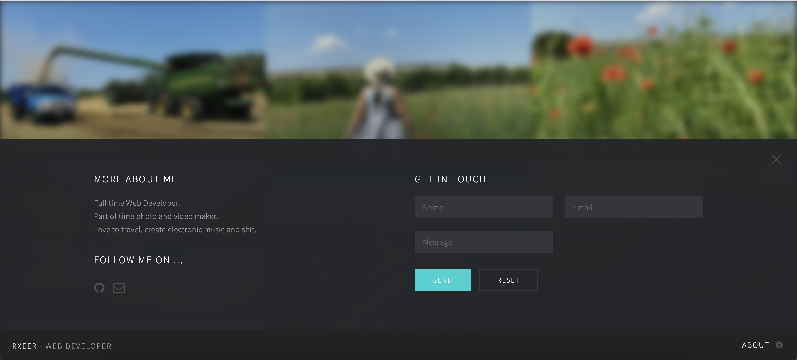

# Photoist

Personal photo album

Check online preview [here](https://photoist.netlify.app/)

To start the project you should:

1. install node >=14.0.0
2. add config to `.env` with content
3. run `yarn`
4. run `yarn start`

## Project Commands

1. run `start` - start gatsby in dev mode
2. run `serve` - gatsby serve
3. run `clean` - clean project cache and gatsby files
4. run `build` - build production ready gatsby app
5. run `format` - run prettier for {js,jsx,,ts,tsx,json,md,scss} files
